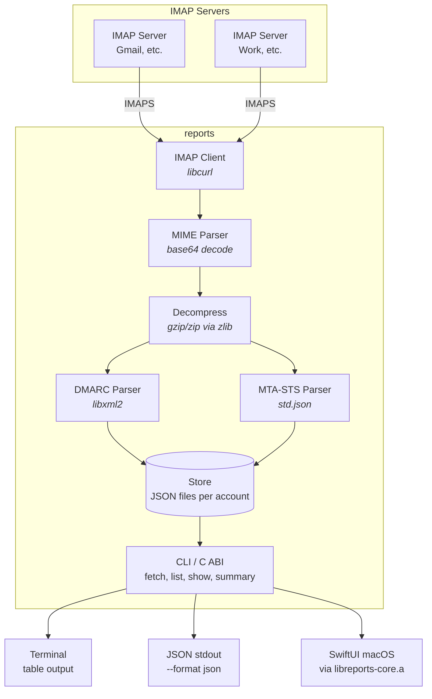

<p align="right"><a href="https://github.com/linyows/reports/blob/main/README.md">English</a> | 日本語</p>

<p align="center">
  
  <br><br>
  DMARC / MTA-STS レポートビューア
</p>

<p align="center">
  <a href="https://github.com/linyows/reports/actions/workflows/test.yml">
    
  </a>
  <a href="https://github.com/linyows/reports/releases">
    
  </a>
</p>

## 特徴

- IMAP経由でDMARC集約レポート (RFC 7489) とTLS-RPTレポート (RFC 8460) を取得
- 複数IMAPアカウント対応（アカウントごとに分離保存）
- XML/JSON形式のレポートをZIP/GZIP解凍してパース
- レポートの一覧、詳細表示、サマリー統計（テーブル/JSON出力）
- アカウント・ドメイン・期間によるフィルタリング
- 差分取得による高速な再実行（取得済みメッセージをスキップ）
- 複数IMAP接続による並列フェッチ（CPUコア数に自動調整、約3.5倍高速化）
- C ABIスタティックライブラリによるネイティブUI連携

## アーキテクチャ



## インストール

### ソースからビルド

Zig 0.15.2以降が必要です。

```bash
$ git clone https://github.com/linyows/reports.git
$ cd reports
$ zig build --release=fast
```

バイナリは `./zig-out/bin/reports` に生成されます。

### 依存ライブラリ

- **libxml2** - DMARC XMLパース
- **libcurl** - IMAP接続
- **zlib** - gzip/zip解凍

macOSではSDKに含まれています。Linuxの場合:

```bash
$ sudo apt-get install libxml2-dev libcurl4-openssl-dev zlib1g-dev
```

## 使い方

### 設定

`~/.config/reports/config.json` を作成:

```json
{
  "accounts": [
    {
      "name": "personal",
      "host": "imap.gmail.com",
      "port": 993,
      "username": "you@gmail.com",
      "password": "your-app-password",
      "mailbox": "INBOX",
      "tls": true
    }
  ]
}
```

Gmailの場合は[アプリパスワード](https://myaccount.google.com/apppasswords)を生成してください。レポートをフィルタリングしている場合は `mailbox` にラベル名を指定します（例: `"dmarc"`）。

### レポートの取得

```bash
$ reports fetch
$ reports fetch --account personal
$ reports fetch --full          # 全メッセージを再取得
```

複数のIMAP接続を使って並列にメッセージを取得します（CPUコア数に自動調整）。2回目以降はUID追跡により取得済みメッセージをスキップし、新着のみを取得します。

### レポート一覧

```bash
$ reports list
ACCOUNT    TYPE     ORGANIZATION         REPORT ID                      DATE              DOMAIN               POLICY
---------- -------- -------------------- ------------------------------ ----------------- -------------------- ----------
personal   DMARC    google.com           12864733003343132926           2026-04-02 00:00  example.com          none
...

$ reports list --account personal --domain example.com
$ reports list --format json
```

### レポート詳細

```bash
$ reports show 12864733003343132926
Organization: google.com
Report ID:    12864733003343132926
Domain:       example.com
Policy:       none

SOURCE IP        COUNT  DISPOSITION  ENVELOPE FROM             HEADER FROM               DKIM   SPF
---------------- ------ ------------ ------------------------- ------------------------- ------ ------
198.51.100.1    4      none                                   example.com              fail   pass

$ reports show 12864733003343132926 --format json
```

### サマリー統計

```bash
$ reports summary --format table
DMARC Reports:    186
TLS-RPT Reports:  0
Total Messages:   547
DKIM/SPF Pass:    182
DKIM/SPF Fail:    365

$ reports summary --period month --format table
PERIOD        DMARC  TLS-RPT   MESSAGES     PASS     FAIL
------------ ------ -------- ---------- -------- --------
2026-04          37        0         96       58       38
2025-12          12        0         30       20       10
...

$ reports summary --account personal --domain example.com --format json
```

`--period` オプションで `week`、`month`、`year` ごとにグループ化できます。

### ドメイン一覧

```bash
$ reports domains
example.com
example.org

$ reports domains --format json
```

## パフォーマンス

`fetch` コマンドは複数のIMAP接続を使ってメッセージを並列にダウンロードします。ワーカー数はCPUコア数に基づいて自動決定されます（最大16）。

| モード | 224件のメッセージ |
|---|---|
| 逐次（単一接続） | 1分54秒 |
| 並列（自動調整） | 33秒 |

差分取得によるUID追跡により、2回目以降は新着メッセージのみを取得するため、定常的な利用ではほぼ即座に完了します。

## C ABI / SwiftUI連携

ビルドするとスタティックライブラリとCヘッダーが生成されます:

```bash
$ zig build
$ ls zig-out/lib/libreports-core.a
$ ls zig-out/include/reports.h
```

```c
#include "reports.h"

reports_init();
char *json = reports_list(config_json);
// jsonを使用...
reports_free_string(json);
reports_deinit();
```

## 開発

```bash
# ビルド
zig build

# テスト実行
zig build test

# フォーマットチェック
zig fmt --check src/

# 実行
zig build run -- help
```

## Author

[linyows](https://github.com/linyows)
