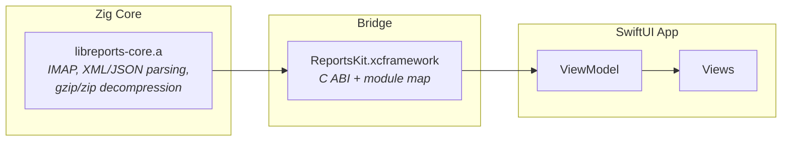

# Reports macOS App

A native macOS application for viewing DMARC and MTA-STS reports.
Built with SwiftUI, powered by the Zig core library (`libreports-core.a`) via C ABI.

## Requirements

| Tool | Version | Install |
|------|---------|---------|
| [Zig](https://ziglang.org/) | 0.15.2+ | [Download](https://ziglang.org/download/) |
| Xcode | 16.0+ | App Store |
| [xcodegen](https://github.com/yonaskolb/XcodeGen) | Latest | `brew install xcodegen` |

System libraries (libxml2, libcurl, zlib) are included in the macOS SDK.

## Architecture



## Build

### Full build (library + app)

```bash
cd macos
make all
```

This runs the following steps in order:

1. `build.sh` — Build the Zig static library and create XCFramework
2. `xcodegen generate` — Generate Xcode project from `project.yml`
3. `xcodebuild` — Build the app in Release configuration

### Individual targets

```bash
make lib          # Zig static library only
make xcframework  # Create XCFramework (includes lib)
make xcode        # Generate Xcode project
make build        # Build the app
make open         # XCFramework + project generation, then open in Xcode
```

### Create DMG

```bash
make dmg
```

Produces `Reports-macOS-arm64.dmg`.

### Clean

```bash
make clean
```

## Distribution

Pushing a tag (`v*`) to GitHub triggers a GitHub Actions workflow that automatically builds the DMG and uploads it to the GitHub Release.

The app is currently distributed unsigned.

### Installation

1. Download `Reports-macOS-arm64.dmg` from [GitHub Releases](https://github.com/linyows/reports/releases)
2. Open the DMG and drag `Reports.app` to the `Applications` folder
3. On first launch, Gatekeeper will show a warning since the app is unsigned:
   - **Right-click** `Reports.app` and select **Open**, or
   - Go to **System Settings > Privacy & Security** and click **Open Anyway**
